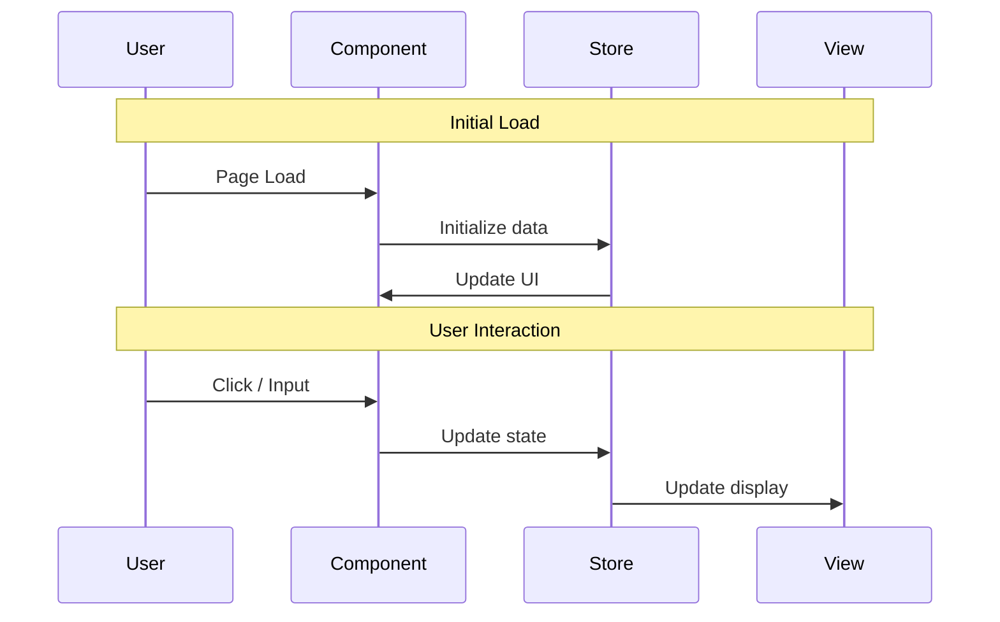

# [ID] [Feature Name] - Implementation Plan

## User Story

As a [user type], I want [desired functionality], so that [benefit/value].

## Pre-conditions

- [Pre-condition 1]
- [Pre-condition 2]

## Design

### Visual Layout

[Describe the visual layout: main components, structure, key UI elements and arrangement]

### Color and Typography

- **Background Colors**:
  - Primary: `bg-white dark:bg-gray-900`
  - Secondary: `bg-gray-50 dark:bg-gray-800`
- **Typography**:
  - Headings: `font-inter text-2xl font-semibold text-gray-900 dark:text-white`
  - Body: `font-inter text-base text-gray-600 dark:text-gray-300`
- **Component-Specific**:
  - Cards: `bg-white dark:bg-gray-800 shadow-md hover:shadow-lg`
  - Buttons: `bg-blue-500 text-white hover:bg-blue-600 active:bg-blue-700`

### Interaction Patterns

- **[Interaction 1]**: [Describe hover, click, loading, and accessibility behavior]
- **[Interaction 2]**: [Describe focus, validation, and helper text behavior]

### Measurements and Spacing

```
Container:    max-w-7xl mx-auto px-4 sm:px-6 lg:px-8
Section:      py-12 md:py-16
Card:         p-4 md:p-6
Grid gap:     gap-4 md:gap-6
Vertical:     space-y-6
```

### Responsive Behavior

- **Desktop (lg: 1024px+)**: [layout description]
- **Tablet (md: 768px–1023px)**: [layout description]
- **Mobile (< 768px)**: [layout description]

## Technical Requirements

### Component Structure

```
src/app/[feature-path]/
├── page.tsx
└── _components/
    ├── [Component1].tsx     # [Description]
    ├── [Component2].tsx     # [Description]
    └── [useCustomHook].ts   # [Description]
```

### Required Components

- [ ] [Component1]
- [ ] [Component2]
- [ ] [useCustomHook]

### State Management Requirements

```typescript
interface [FeatureName]State {
  // UI States
  isLoading: boolean;
  isOpen: boolean;

  // Data States
  items: Item[];
  selectedItem: Item | null;
}
```

## Acceptance Criteria

### Layout & Content

1. [Section 1]
   - [Criterion]
   - [Criterion]

2. [Section 2]
   - [Criterion]
   - [Criterion]

### Functionality

1. [Functionality Group 1]
   - [ ] [Criterion 1.1]
   - [ ] [Criterion 1.2]

2. [Functionality Group 2]
   - [ ] [Criterion 2.1]
   - [ ] [Criterion 2.2]

### Navigation Rules

- [Rule 1]
- [Rule 2]

### Error Handling

- [Error strategy 1]
- [Error strategy 2]

## Modified Files

```
src/app/[feature-path]/
├── page.tsx ⬜
└── _components/
    ├── [Component1].tsx ⬜
    ├── [Component2].tsx ⬜
    └── [useCustomHook].ts ⬜
└── types/
    └── [types].ts ⬜
```

## Status

⬜ NOT STARTED

1. Setup & Configuration
   - [ ] [Task]
   - [ ] [Task]

2. Layout Implementation
   - [ ] [Task]
   - [ ] [Task]

3. Feature Implementation
   - [ ] [Task]
   - [ ] [Task]

4. Testing
   - [ ] [Task]
   - [ ] [Task]

## Dependencies

- [Dependency 1]
- [Dependency 2]

## Related Stories

- [ID] ([Brief description])

## Notes

### Technical Considerations

1. [Consideration]
2. [Consideration]

### Business Requirements

- [Requirement]
- [Requirement]

### API Integration

#### Type Definitions

```typescript
interface [EntityName] {
  id: string;
  name: string;
  [property]: [Type];
}
```

#### Mock Server Configuration

```typescript
// mocks/stub.ts
const mocks = [
  {
    endPoint: [endPointReference],
    json: '[filename].json',
  },
];
```

#### Mock Response

```json
{
  "status": "SUCCESS",
  "data": {
    "items": [
      { "id": "1", "name": "Example" }
    ]
  }
}
```

### State Management Flow



## Testing Requirements

### Integration Tests (Target: 80% Coverage)

```typescript
describe('Core Functionality', () => {
  it('should [expected behavior]', async () => {
    // Test implementation
  });

  it('should [state update behavior]', async () => {
    // Test implementation
  });
});

describe('Responsive Behavior', () => {
  it('should handle responsive layout correctly', async () => {
    // Test implementation
  });
});

describe('Edge Cases', () => {
  it('should handle missing data gracefully', async () => {
    // Test implementation
  });
});
```

### Accessibility Tests

```typescript
describe('Accessibility', () => {
  it('should provide appropriate ARIA attributes', async () => {
    // Test implementation
  });
});
```
