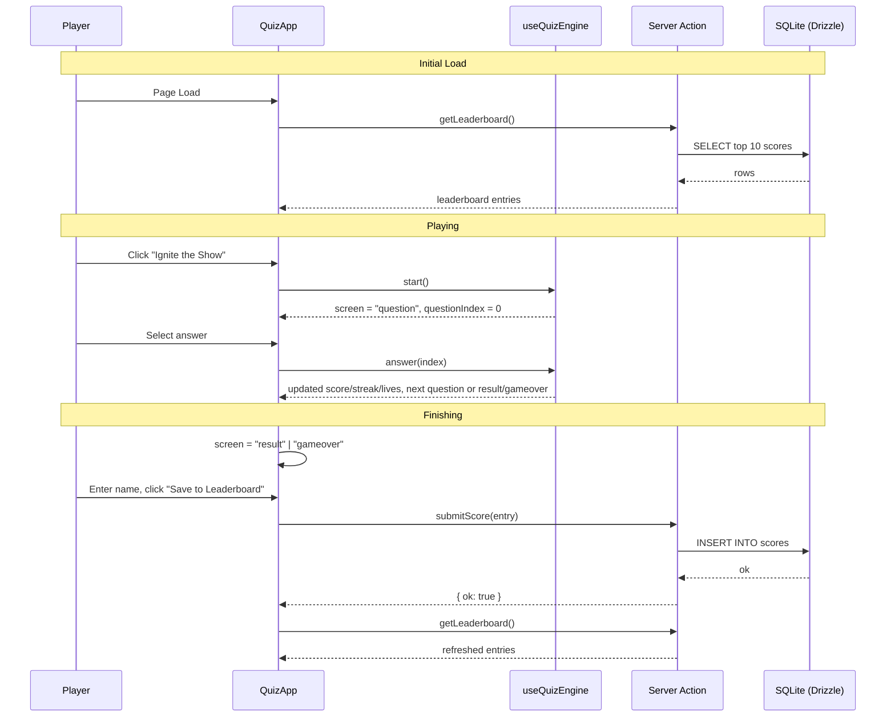

# NDP26-01 SG61 Drone Show Quiz - Implementation Plan

## User Story

As a Singapore-based visitor to the NDP61 microsite, I want to play a fast-paced, localised trivia/instinct quiz themed around the National Day Parade 2026 (SG61) — featuring genuine heartland culture, NDP61 facts, and this year's viral trends (Labubu, drone shows, etc.) — so that I feel a fun sense of national pride, learn a few real SG61 facts, and want to share my score with friends before/around National Day.

## Pre-conditions

- Existing T3-stack scaffold at the repo root is functional (`npm run dev` boots the default Next.js page).
- No component library, `cn()` utility, or `/api` routes exist yet — this feature introduces the first real UI and the first DB table beyond the T3 starter's `post` example.
- `db.sqlite` / `@libsql/client` + Drizzle are wired up and `drizzle-kit push` works against `DATABASE_URL`.
- Reference file [how-singaporean-are-you_1.html](../../how-singaporean-are-you_1.html) exists in the repo as a static HTML prototype; it is **not** the design system for this build (a new visual theme is used, see below) but its game-loop mechanics (timer bonus, streak multiplier, lives, feed transitions, reduced-motion handling) are proven and should be ported into React/TypeScript.

## Design

### Concept

The reference file used a "kopitiam ticket / queue number" carnival aesthetic. For this build we use a **distinct new theme**: **"SG61 Countdown: National Stadium Drone Show"** — inspired by the confirmed NDP 2026 facts that the parade returns to the National Stadium and, for the first time in NDP history, features an indoor drone show alongside a nationwide treasure hunt and an official 3-song concept album (replacing the usual single theme song).

Instead of tearing a paper ticket stub, the player is "launching" a formation of 15 drones (one per question) into a night sky above the National Stadium. Each correct answer lights up a drone gold; each miss lets a drone go dark/fall out of formation. The finale renders the drone formation + fireworks as the results "show."

### Visual Layout

- **Landing screen**: Full-bleed dark navy stadium-at-night gradient with animated floodlight beams sweeping from the bottom corners (CSS conic/radial gradients, respects `prefers-reduced-motion`). Center card holds the bold title lockup, a one-line premise, and a single primary CTA ("Ignite the Show →").
- **Question screen**: A dark "scoreboard" card (rounded rect, subtle drop shadow, thin gold hairline border) containing:
  - Top HUD bar: round label (left), digital countdown timer (center, LED/mono digits), drones-remaining + score + personal best (right).
  - A horizontal **Drone Formation Track** (15 small drone-glyph dots) showing progress; answered questions render gold (correct) or dim/red (missed); the current question pulses.
  - Question text, then 3–4 answer options rendered as selectable "flight command" rows (not radio buttons) with a lettered marker (A/B/C/D).
  - A streak/"Formation Sync" pill appears once streak ≥ 2 (×1.5) or ≥ 4 (×2), mirroring the proven multiplier mechanic from the reference prototype.
- **Feedback**: Correct answer row glows gold with a `+points` pop; wrong answer row glows crimson, the correct row is revealed, and the whole card does a short horizontal shake (skipped under reduced motion).
- **Results screen ("Grand Finale")**: Animated fireworks burst (CSS, canvas-free) behind a "verdict" LED-signboard flap-reveal (e.g. "TRUE BLUE SINGAPOREAN"), score receipt, "NEW HIGH SCORE" callout when applicable, a name-entry field + "Save to Leaderboard" action (server action), a "Copy result" share action, and a link to view the Top 10 Leaderboard.
- **Game-over screen** ("Drones Grounded"): shown if all 3 drones are lost before finishing; same save/share/leaderboard actions as the results screen.
- **Leaderboard panel**: Simple ranked list (rank, name, score, correct/total), fetched server-side.

### Color and Typography

Palette is adapted from the reference file's red/gold Singapore accents, re-based on a navy "night sky" background rather than the reference's cream paper background, to fit the new drone-show/stadium concept:

- **Background**:
  - Primary: `--sg-navy: #0B1B2E` → `--sg-navy-deep: #050C16` (radial gradient, stadium-at-night)
  - Card surface: `--sg-panel: #101F33` with `1px` hairline border `--drone-gold: #E8B23D` at 25% opacity
- **Accent colors**:
  - Singapore flag red: `--sg-red: #CE1126` (CTAs, misses, crimson glow)
  - Drone gold: `--drone-gold: #E8B23D` (correct states, progress dots, HUD digits)
  - Stadium white: `--sg-white: #F5F5F0` (primary text on navy)
  - Muted ink: `--sg-mist: #8FA0B8` (secondary/body text on navy)
  - Success teal (kept from reference for correct-state secondary accent): `--sg-teal: #3F6F68`
- **Typography** (adding two Google Fonts via `next/font/google`, alongside the existing Geist Sans body font):
  - Display/headings: `Big Shoulders Display` 700/800 — bold condensed scoreboard feel (`text-4xl md:text-6xl font-extrabold tracking-tight text-[--drone-gold]`)
  - HUD/countdown/mono digits: `IBM Plex Mono` 500/600 — LED-digit feel (`font-mono text-sm tracking-widest text-[--sg-white]`)
  - Body/options: existing Geist Sans (`font-sans text-[15px] text-[--sg-mist]`)
- **Component-specific**:
  - Cards: `bg-[--sg-panel] border border-[--drone-gold]/25 shadow-[0_20px_48px_rgba(0,0,0,0.45)] rounded-sm`
  - Primary button: `bg-[--sg-red] text-[--sg-white] hover:bg-[#a30d1e] shadow-[0_6px_0_#8a0d1c]`
  - Answer row (default / correct / wrong): `border-b border-white/10` / `bg-[--sg-teal]/20` / `bg-[--sg-red]/20`

### Interaction Patterns

- **Answer selection**: click/tap or keyboard (`Enter`/`Space` on a focused `button`) locks in the answer immediately (no "submit" step), matching the reference prototype's instant-feedback loop. All options become `pointer-events: none` once one is chosen.
- **Timer**: a shrinking gold→amber→red bar plus mono countdown digits; reaching zero auto-submits as a miss (same as reference `handleAnswer(index, -1)` timeout behavior).
- **Streak pill**: appears/disappears based on `streak` state; screen-reader text announces "Formation sync ×1.5" etc. via `aria-live="polite"`.
- **Leaderboard submit**: optimistic UI (button shows a spinner state) while the server action runs; on failure, an inline toast reads "Couldn't save — check your connection" and the score remains visible locally (not lost).
- **Focus/accessibility**: all interactive elements have visible `focus-visible` rings in `--drone-gold`; the feedback pop-up and streak pill live in an `aria-live="polite"` region; `prefers-reduced-motion` disables the shake, floodlight sweep, fireworks burst, and timer-fill transition (matches reference's existing `@media (prefers-reduced-motion: reduce)` block, ported as-is).

### Measurements and Spacing

```
Container:       max-w-[440px] mx-auto px-4
Stage padding:   pt-9 pb-12
Card padding:    p-6 md:p-7
Answer row gap:  (no gap, full-bleed rows with dashed/hairline dividers, like reference)
HUD gap:         gap-2, text-[11.5px]
Vertical rhythm: space-y-4 within card, space-y-5 between HUD/track/card
```

### Responsive Behavior

- **Mobile (< 768px, primary target — this is a share-and-play microsite)**: single-column stage, card width `min(440px, 92vw)`, sticky-feeling HUD at top of the stage (not `position: sticky`, just first in flow since the whole layout is short).
- **Tablet (768–1023px)**: same single-column layout, card stays capped at 440px and centers with more surrounding negative space (floodlight/ambient background more visible).
- **Desktop (1024px+)**: identical centered single-column card (this is intentionally not a desktop dashboard); ambient canvas background fills the full viewport behind it.

## Technical Requirements

### Component Structure

```
src/app/
├── page.tsx                          # Server Component: loads leaderboard (top 10), renders <QuizApp>
├── actions.ts                         # Server Actions: submitScore(name, score, correctCount), getLeaderboard()
├── layout.tsx                         # + register Big Shoulders Display / IBM Plex Mono via next/font/google
├── _components/
│   ├── QuizApp.tsx                    # Client component; owns game state machine (intro/question/result/gameover)
│   ├── AmbientDroneField.tsx          # Client component; canvas ambient particle/floodlight background (ported from reference's ember canvas)
│   ├── ScoreboardHud.tsx              # Round label, countdown, drones-remaining, score, personal best
│   ├── DroneFormationTrack.tsx        # 15-dot progress track (per-question state: pending/active/correct/missed)
│   ├── QuestionCard.tsx               # Question text + answer rows + streak pill + timer bar
│   ├── ResultScreen.tsx               # "Grand Finale" — verdict, receipt, save-to-leaderboard form, share button
│   ├── GameOverScreen.tsx             # "Drones Grounded" — same actions as ResultScreen
│   ├── Leaderboard.tsx                # Server Component; ranked list of top scores
│   └── useQuizEngine.ts               # Hook encapsulating timer/scoring/streak/lives logic (pure, testable)
├── _data/
│   └── questions.ts                   # QUESTIONS: 3 rounds × 5 questions (content finalised below)
└── _lib/
    └── types.ts                       # Question, Round, GameScreen, QuizState types
src/server/db/
├── schema.ts                          # + `scores` table (see Modified Files)
└── queries.ts                         # getTopScores(limit), insertScore(entry) — thin Drizzle wrappers used by actions.ts
```

### Required Components

- [ ] `QuizApp` (state machine root)
- [ ] `AmbientDroneField` (ambient canvas background)
- [ ] `ScoreboardHud`
- [ ] `DroneFormationTrack`
- [ ] `QuestionCard`
- [ ] `ResultScreen`
- [ ] `GameOverScreen`
- [ ] `Leaderboard`
- [ ] `useQuizEngine` (hook)
- [ ] `actions.ts` (`submitScore`, `getLeaderboard` Server Actions)
- [ ] `server/db/queries.ts` (`getTopScores`, `insertScore`)

### State Management Requirements

```typescript
type GameScreen = "intro" | "question" | "result" | "gameover";
type RoundId = "instinct" | "trivia" | "trend";

interface QuizOption {
  label: string;
  correct: boolean;
}

interface QuizQuestion {
  round: RoundId;
  roundLabel: string;   // e.g. "ROUND 1 · HEARTLAND INSTINCT"
  timeLimitMs: number;
  text: string;
  options: QuizOption[];
}

interface QuizState {
  // UI state
  screen: GameScreen;
  questionIndex: number;
  isSubmittingScore: boolean;

  // Game state
  lives: number;              // starts at 3 ("drones in reserve")
  streak: number;
  score: number;
  correctCount: number;
  answerLog: boolean[];       // per-question correct/incorrect, in order

  // Persistence state
  bestScore: number;
  justHitNewBest: boolean;
  playerName: string;
  leaderboard: LeaderboardEntry[];
}

interface LeaderboardEntry {
  id: number;
  playerName: string;
  score: number;
  correctCount: number;
  totalQuestions: number;
  createdAt: string; // ISO
}
```

## Acceptance Criteria

### Layout & Content

1. Landing screen
   - Displays the SG61 Drone Show title lockup, one-line premise, and a single "Ignite the Show" CTA.
   - Ambient floodlight/particle background renders behind the card and is disabled under `prefers-reduced-motion`.
2. Question screen
   - HUD always shows current round label, live countdown, drones remaining (out of 3), current score, and personal best.
   - Drone Formation Track shows exactly 15 dots; the active question's dot is visually distinct from answered ones.
   - Exactly one question is visible at a time; options are never pre-selected.
3. Results / Game-over screens
   - Show correct count out of 15, final arcade score, a verdict tier (see scoring below), and (if applicable) a "NEW HIGH SCORE" callout.
   - Provide a name field + "Save to Leaderboard" action and a "Copy result" action.

### Functionality

1. Scoring & timing
   - [ ] Correct answer within the time limit awards `100 + round(100 × remaining_time_fraction)` points, matching the reference prototype's formula.
   - [ ] A streak of 2–3 correct answers applies a ×1.5 multiplier; a streak of 4+ applies ×2. Any incorrect/timeout answer resets streak to 0.
   - [ ] A missed/timed-out question deducts one life (drone) and does not award points.
   - [ ] Reaching 0 lives before question 15 routes to the Game-over screen; otherwise the Results screen shows after question 15.
2. Verdict tiers (percentage of 15 correct)
   - [ ] ≥90% → "True Blue Singaporean"
   - [ ] ≥70% → "Certified Heartlander"
   - [ ] ≥50% → "Honorary PR"
   - [ ] <50% → "Tourist Vibes"
3. Persistence
   - [ ] `submitScore` Server Action inserts a row into the `scores` table via Drizzle and revalidates the leaderboard.
   - [ ] `getLeaderboard` returns the top 10 scores ordered by `score DESC, createdAt ASC`.
   - [ ] If the save fails (network/DB error), the UI shows an inline error and does not lose the player's on-screen result.
4. Content
   - [ ] All 15 questions render from `_data/questions.ts` (3 rounds × 5 questions, content specified in Notes below) with exactly one correct option flagged per question.

### Navigation Rules

- The quiz always starts at question 1 of Round 1 (Heartland Instinct) → Round 2 (SG61 Trivia) → Round 3 (Trending Now), in that fixed order.
- There is no "back" navigation once an answer is locked in.
- Refreshing mid-quiz restarts from the intro screen in v1 (in-progress state is not persisted — only completed-run scores are saved).
- "Play again" and "Try again" always return to the intro screen and fully reset `QuizState` (except `bestScore`, `leaderboard`).

### Error Handling

- Server Action failures (DB write/read) are caught and surfaced as a non-blocking inline message; they never crash the quiz UI.
- If `questions.ts` fails to provide 15 valid questions (defensive dev-time check only, not user-facing), fail the build via a TypeScript `satisfies`/length assertion rather than at runtime.
- Clipboard API failure on "Copy result" falls back to a visible "Copy not available — screenshot instead" message (ported from reference prototype).

## Modified Files

```
src/app/
├── page.tsx ⬜
├── layout.tsx ⬜ (font registration)
├── actions.ts ⬜
├── _components/
│   ├── QuizApp.tsx ⬜
│   ├── AmbientDroneField.tsx ⬜
│   ├── ScoreboardHud.tsx ⬜
│   ├── DroneFormationTrack.tsx ⬜
│   ├── QuestionCard.tsx ⬜
│   ├── ResultScreen.tsx ⬜
│   ├── GameOverScreen.tsx ⬜
│   ├── Leaderboard.tsx ⬜
│   └── useQuizEngine.ts ⬜
├── _data/
│   └── questions.ts ⬜
└── _lib/
    └── types.ts ⬜
src/server/db/
├── schema.ts ⬜ (add `scores` table)
└── queries.ts ⬜ (new)
src/styles/globals.css ⬜ (add `--sg-*`/`--drone-gold` theme tokens)
```

## Status

⬜ NOT STARTED

1. Setup & Configuration
   - [ ] Add `Big Shoulders Display` + `IBM Plex Mono` via `next/font/google` in `layout.tsx`
   - [ ] Add new color tokens to `globals.css` `@theme` block
   - [ ] Add `scores` table to `schema.ts`; run `drizzle-kit generate` + `drizzle-kit push`

2. Layout Implementation
   - [ ] Build `AmbientDroneField`, `ScoreboardHud`, `DroneFormationTrack` static/visual shells
   - [ ] Build `QuestionCard` layout with mock data

3. Feature Implementation
   - [ ] Implement `useQuizEngine` (timer, scoring, streak, lives, transitions)
   - [ ] Wire `QuizApp` state machine across intro/question/result/gameover
   - [ ] Implement `actions.ts` + `server/db/queries.ts` for leaderboard read/write
   - [ ] Implement `ResultScreen`/`GameOverScreen` save + share actions
   - [ ] Populate `_data/questions.ts` with the 15 finalised questions

4. Testing
   - [ ] Unit test `useQuizEngine` scoring/streak/lives math
   - [ ] Integration test full quiz run (happy path + game-over path)
   - [ ] Accessibility pass (keyboard-only run-through, reduced-motion check)

## Dependencies

- `next/font/google` (already available via Next.js — no new package) for `Big Shoulders Display` and `IBM Plex Mono`.
- Existing `drizzle-orm` / `@libsql/client` / `db.sqlite` setup — no new DB package required.
- No new npm packages required for v1 (no animation library; CSS + a lightweight canvas ambient background, matching the reference prototype's dependency-free approach).

## Related Stories

- None — this is the first feature story for this workspace.

## Notes

### Technical Considerations

1. Use React 19 **Server Actions** (`"use server"` in `src/app/actions.ts`) rather than hand-rolled `/api` route handlers — this repo has no tRPC/API convention yet, and Server Actions are the lowest-friction way to mutate data from a Client Component (`QuizApp`) while keeping `page.tsx`/`Leaderboard` as Server Components for the initial leaderboard read.
2. All game-loop logic (timer countdown, scoring formula, streak multiplier, lives) should be ported from the proven reference prototype rather than redesigned from scratch — only the visual layer changes.
3. `AmbientDroneField`'s canvas logic (particle drift, pointer-follow attraction, `prefers-reduced-motion` bail-out) can be adapted near-verbatim from the reference file's `ambient` canvas script.
4. Keep the whole feature client-heavy under one `"use client"` boundary (`QuizApp` and its children) with the two Server Components (`page.tsx`, `Leaderboard`) as the only server-rendered pieces, to keep the state machine simple (matches the reference's single-state-object approach).
5. No auth exists in this app — leaderboard entries are anonymous, user-supplied display names only (trim/limit length; no PII fields).

### Business Requirements

- The quiz must read as a genuine, current-year (SG61 / NDP 2026) artifact, not a generic trivia game — every trivia-round fact must be independently verifiable (sources noted below) and every trend-round fact must reflect something that was actually trending in Singapore within the last ~12 months.
- Avoid politically sensitive or partisan content (elections, executions, party politics, ISA cases) in question content — keep it celebratory/light, consistent with NDP's tone.
- Keep the existing proven mechanics (timer bonus, streak multiplier, 3-lives, verdict tiers, share/copy result) — these are UX-validated in the reference prototype and should not be redesigned, only reskinned.

### Question Bank Content Plan (15 questions, verified against source material)

**Round 1 — Heartland Instinct** (`instinct`, ~8–9s timer, scenario-based, no citation needed — general lived culture)

1. "A void deck has fans, a table and a stack of red plastic chairs set up hours before a wedding dinner starts, no guests in sight yet. You:" → *(correct)* "Walk around it, obviously — that's tonight's wedding, not a free table" / "Sit down, it's clearly abandoned" / "Ask the void deck who's getting married"
2. "3:00pm sharp, sirens wail nationwide for exactly one minute. You:" → *(correct)* "Don't even look up — it's the monthly Public Warning System test" / "Evacuate immediately" / "Assume it's an ice-cream truck"
3. "You finish your hawker meal and the tray is still full of bones and tissue. You:" → *(correct)* "Return the tray yourself — NEA will fine you otherwise" / "Leave it, cleaners will handle it" / "Stack it on someone else's table"
4. "You spot the Red Lions doing a rehearsal jump in the sky near your HDB block weeks before National Day. You:" → *(correct)* "Grab your phone and film it immediately, like everyone else on your floor" / "Assume it's a drone delivery" / "Call SCDF to report a falling object"
5. "Long queue behind you, auntie's waiting, you need to order fast: 'One teh peng siew dai, one kopi-o kosong.' You just ordered:" → *(correct)* "Iced milk tea with less sugar, and black coffee with no sugar" / "Two identical black coffees" / "Hot tea and iced coffee, both extra sweet"

**Round 2 — SG61 & NDP Trivia** (`trivia`, ~6–6.5s timer, facts verified via Wikipedia "National Day Parade" and "2026 in Singapore", July 2026 revisions)

6. "2026 is officially known as SG61 in Singapore because:" → *(correct)* "It marks 61 years since Singapore's 1965 independence" / "It's the 61st NDP theme song" / "Singapore turns 61 million in population"
7. "After three years at the Padang, NDP 2026 returns to which venue?" → *(correct)* "The National Stadium" / "The Float @ Marina Bay" / "Sentosa"
8. "For the first time in NDP history, 2026's parade breaks tradition musically by having:" → *(correct)* "Three specially-composed theme songs from an official concept album, instead of the usual one" / "No theme song at all, again" / "A theme song only in Malay"
9. "Alongside the parade, NDP 2026 introduces two brand-new experiences — an indoor drone show and:" → *(correct)* "A nationwide treasure hunt" / "A citywide scavenger marathon" / "A hawker cook-off"
10. "Singapore's newest aquarium, the Singapore Oceanarium at Sentosa (opened July 2025, replacing the old SEA Aquarium), has how many zones?" → *(correct)* "22 zones" / "8 zones" / "50 zones"

**Round 3 — Trending Now** (`trend`, ~6–6.5s timer, facts verified via Wikipedia "Labubu" and "2026 in Singapore")

11. "Labubu, the toothy monster doll that had crowds camping outside malls, belongs to which Pop Mart toy line?" → *(correct)* "The Monsters" / "The Creatures" / "Wild Tribe"
12. "Labubu's craze exploded across Southeast Asia in April 2024 after which celebrity was spotted with one on her bag?" → *(correct)* "Blackpink's Lisa" / "Ariana Grande" / "Rihanna"
13. "In October 2024, a Singapore temple dressed four Labubu figures in white robes and yellow sashes as 'devotees' during which festival?" → *(correct)* "Nine Emperor Gods Festival" / "Vesak Day" / "Thaipusam"
14. "In July 2025, a sinkhole swallowed a passing car on which Singapore road?" → *(correct)* "Tanjong Katong Road" / "Orchard Road" / "Bukit Timah Road"
15. "Singapore's new driverless shuttle service, Ai.R, began public operations in April 2026 in which town?" → *(correct)* "Punggol" / "Tampines" / "Jurong East"

### API Integration

No external API is used. All game content is static (`_data/questions.ts`); the only "integration" is the internal Drizzle-backed leaderboard.

#### Type Definitions

```typescript
interface ScoreEntry {
  id: number;
  playerName: string;
  score: number;
  correctCount: number;
  totalQuestions: number;
  createdAt: number; // unix epoch, matches existing schema convention
}
```

#### Server Action Contract (replaces Mock Server Configuration — no mocks needed, DB is local SQLite)

```typescript
// src/app/actions.ts
"use server";

export async function submitScore(input: {
  playerName: string;
  score: number;
  correctCount: number;
  totalQuestions: number;
}): Promise<{ ok: true } | { ok: false; error: string }> { /* ... */ }

export async function getLeaderboard(limit = 10): Promise<ScoreEntry[]> { /* ... */ }
```

#### Example Response Shape

```json
{
  "leaderboard": [
    { "id": 12, "playerName": "JT", "score": 3120, "correctCount": 14, "totalQuestions": 15, "createdAt": 1753200000 }
  ]
}
```

### State Management Flow



## Testing Requirements

### Integration Tests (Target: 80% Coverage)

```typescript
describe('useQuizEngine', () => {
  it('should award more points the faster a correct answer is given', async () => {
    // Test implementation
  });

  it('should apply a x1.5 multiplier at streak >= 2 and x2 at streak >= 4', async () => {
    // Test implementation
  });

  it('should reset streak to 0 on an incorrect or timed-out answer', async () => {
    // Test implementation
  });

  it('should transition to "gameover" when lives reach 0 before question 15', async () => {
    // Test implementation
  });

  it('should transition to "result" after question 15 with lives remaining', async () => {
    // Test implementation
  });
});

describe('Leaderboard persistence', () => {
  it('should insert a new score via submitScore and reflect it in getLeaderboard', async () => {
    // Test implementation
  });

  it('should surface an inline error without losing the on-screen result if submitScore fails', async () => {
    // Test implementation
  });
});

describe('Responsive Behavior', () => {
  it('should render the quiz card within a 440px-capped, centered column at all breakpoints', async () => {
    // Test implementation
  });
});

describe('Edge Cases', () => {
  it('should handle an empty/failed leaderboard fetch by rendering an empty-state list', async () => {
    // Test implementation
  });
});
```

### Accessibility Tests

```typescript
describe('Accessibility', () => {
  it('should allow full keyboard navigation through intro -> question -> result', async () => {
    // Test implementation
  });

  it('should announce correct/incorrect feedback via an aria-live region', async () => {
    // Test implementation
  });

  it('should disable shake/floodlight/fireworks animations under prefers-reduced-motion', async () => {
    // Test implementation
  });
});
```
