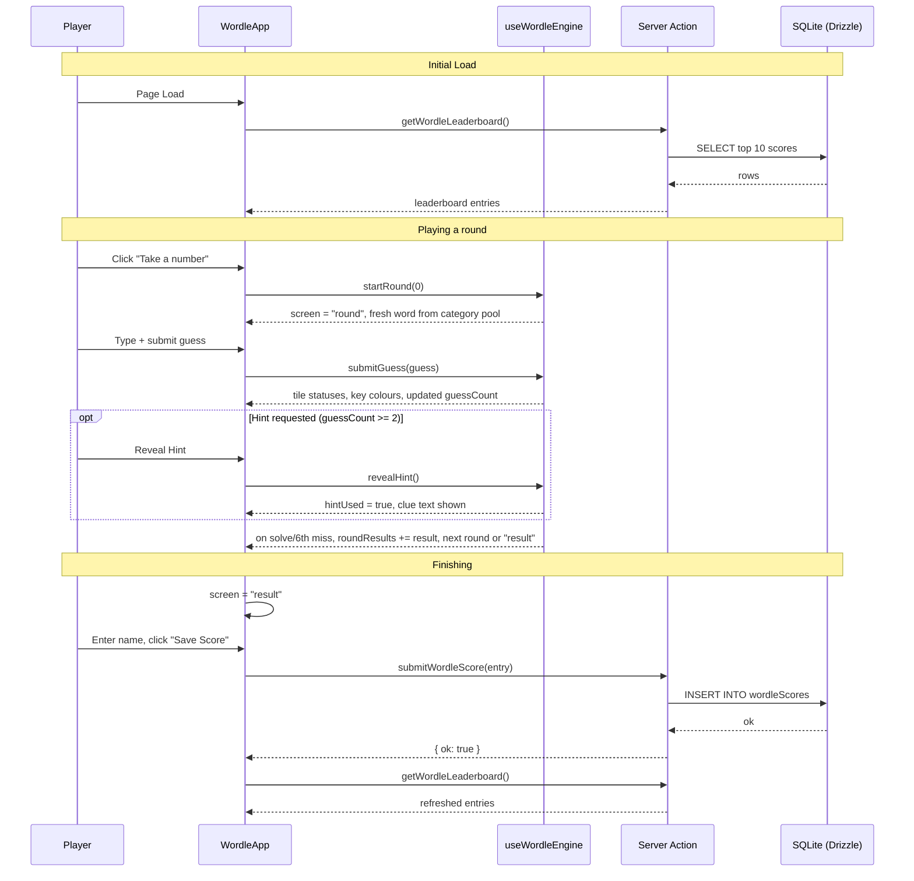

# NDP26-02 SG61 Word Ticket (Singlish Wordle) - Implementation Plan

## User Story

As a Singapore-based visitor to the NDP61 microsite, I want to play a Wordle-style word-guessing game built entirely from genuine, localised Singapore vocabulary — heartland instincts, kopitiam ordering terms, and everyday Singlish, spread across three "ticket" rounds — so that I feel a fun sense of national pride, learn (or rediscover) real local words in the run-up to National Day, and want to share my result with friends.

## Pre-conditions

- Existing T3-stack scaffold at the repo root is functional (`npm run dev` boots the default Next.js page).
- This is the sole game on the SG61 microsite — it ships at the root route, replacing the default T3 boilerplate homepage in `src/app/page.tsx`.
- Reference file [prototype-sg61-wordle.html](../../prototype-sg61-wordle.html) exists in the repo as a static HTML prototype; its **game-loop mechanics are proven and should be ported into React/TypeScript as-is**: 3 fixed rounds, 6 guesses per word, per-letter evaluate (correct/present/absent) with duplicate-letter counting, on-screen + physical keyboard, hint unlock after 2 guesses (score penalty if used), tile flip reveal, guess-count-based scoring table, and a final recap with emoji grid + copy-to-clipboard share text.
- Reference file [how-singaporean-are-you_1.html](../../how-singaporean-are-you_1.html) exists in the repo as a static HTML prototype; **this feature reuses that file's "kopitiam ticket" design tokens directly** (paper background, red/gold/teal accents, perforated ticket-stub styling, Big Shoulders Display + IBM Plex Mono/Sans fonts) per explicit design direction — this keeps the Wordle game visually paired with the "queue ticket" identity of the SG61 microsite.
- `db.sqlite` / `@libsql/client` + Drizzle are wired up and `drizzle-kit push` works against `DATABASE_URL`.

## Design

### Concept

The reference prototype's plain dark "drone/navy" Wordle shell is **reskinned as a torn ticket stub** — matching the "take a number, queue rush" identity from `how-singaporean-are-you_1.html` — while keeping every proven game mechanic (rounds, hints, scoring, keyboard) unchanged. The player is handed a fresh "word ticket" for each of the 3 rounds (Heartland Instinct → Kopitiam Terms → Local Slang), and the finale renders as a stamped receipt in the same rotated verdict-stamp style used throughout the reference prototypes.

### Visual Layout

- **Landing screen**: Centered paper ticket card (perforated top/bottom edge, subtle paper-grain texture, `rotate(-0.6deg)`) on the red gradient + fine-ruled background from the reference file. Contains eyebrow label ("SG61 · WORD TICKET"), a bold red display title ("GUESS THE WORD"), a short premise line explaining the 3 rounds and hint rule, and a single primary CTA ("Take a number →").
- **Round/question screen**: Same ticket card, now showing:
  - A queue-LED style HUD strip above the ticket: round label + round number (1/3), guess count (n/6), running score, and personal best.
  - Category tag (teal-bordered pill: "HEARTLAND INSTINCT" / "KOPITIAM TERMS" / "LOCAL SLANG").
  - A **locked clue strip** ("6 letters — clue locked. Guess it cold, or unlock a hint after 2 guesses.") that flips to the real clue text (with the answer's defining phrase bolded) once the hint is revealed.
  - A disabled "🔒 Hint unlocks after 2 guesses" button that becomes active (`Reveal Hint (-150 pts)`) once the guess-count threshold is hit.
  - The guess grid: up to 6 rows of letter tiles sized for the current word's length, ticket-paper tile borders, flip-reveal animation on submit.
  - An on-screen QWERTY keyboard (also fully operable via physical keyboard) with per-letter colour memory (teal/gold/muted) carried across guesses.
  - Inline feedback line under the grid ("Keep going.", "Correct! +420 pts", "Out of guesses — it was CHOPE").
- **Round transition**: brief (~1.6s) pause showing the solved/failed state before auto-advancing to the next round's fresh ticket (feed-in/feed-out card transition ported from the reference prototype's ticket transition).
- **Results screen ("Grand Finale" receipt)**: Stamped verdict (e.g. "TRUE BLUE SINGAPOREAN") in the same rotated red-stamp style as the reference file, a per-round recap (word solved/attempts + emoji grid, or "X/6" if missed), total score, "NEW HIGH SCORE" callout when applicable, and two actions: "Play again" and "Copy result".
- **Leaderboard panel** (below the ticket, same route): simple ranked list (rank, name, score, words solved), fetched server-side.

### Color and Typography

Reused verbatim from [how-singaporean-are-you_1.html](../../how-singaporean-are-you_1.html) (not redesigned):

- **Background**: fine vertical rule pattern + red radial gradient — `--red: #BE2A2A`, `--red-deep: #8F1B1B` (`repeating-linear-gradient(...)` over `radial-gradient(ellipse at 50% -10%, var(--red-deep), var(--red) 60%)`).
- **Ticket surface**: `--paper: #FAF6EC` with a subtle SVG-noise `background-blend-mode: multiply` grain overlay, `--paper-shadow: #E4DCC8` for hairline dividers, perforated-edge pseudo-elements (`radial-gradient` circle repeat) top and bottom.
- **Accent colors**:
  - Ink (primary text on paper): `--ink: #2B2622`
  - Gold (hints, "present" letters, streak/queue accents): `--gold: #E8B23D`
  - Teal ("correct" letters, secondary tags): `--teal: #3F6F68`
  - Pink (reserved for a 3rd distinguishing accent, e.g. round-3 category tag): `--pink: #C23B6B`
- **Typography** (same Google Fonts stack as the reference file, loaded via `next/font/google` in `layout.tsx`):
  - Display/headings: `Big Shoulders Display` 700/800 (`font-[--font-display] text-[clamp(34px,8vw,46px)] font-extrabold leading-[0.95] text-[--red]`)
  - HUD/tiles/keyboard/mono digits: `IBM Plex Mono` 500/600 (`font-[--font-mono] text-[11px] tracking-wide`)
  - Body/clue/recap text: `IBM Plex Sans` 400/500/600 (`font-[--font-sans] text-sm text-[#5a5147]`)
- **Component-specific** (adapted 1:1 from the reference file's `.ticket`, `.tile`, `.key`, `.stamp`, `.opt` classes into Tailwind utility equivalents):
  - Ticket card: `bg-[--paper] shadow-[0_22px_48px_rgba(0,0,0,0.35)] rotate-[-0.6deg]` + perforated pseudo-elements
  - Tile (empty/filled/correct/present/absent): border `border-[--paper-shadow]` → `bg-[--teal]` / `bg-[--gold] text-[--ink]` / `bg-[--paper-shadow] text-[#5a5147]`
  - Primary button: `bg-[--red] text-[--paper] shadow-[0_6px_0_var(--red-deep)] hover:bg-[--red-deep]`
  - Stamp: `border-[3px] border-[--red] text-[--red] rotate-[-9deg]`, stamp-in keyframe on mount

### Interaction Patterns

- **Typing a guess**: physical keyboard keys and on-screen key buttons both feed the same `handleKey()` state update; `Enter` submits, `Backspace`/⌫ deletes, non-letter keys ignored.
- **Guess submission**: grid row shakes on an incomplete guess ("Not enough letters"); on a valid guess, tiles flip left-to-right with a staggered delay before colour is revealed, then keyboard key colours update (priority: correct > present > absent, never downgrades a key already marked correct).
- **Hint unlock**: hint button is disabled and shows a lock icon + guess-threshold copy until `guessCount >= 2`; once tapped, the clue text is revealed permanently for that word and a score penalty (-150, floor 50) is applied only if the word is subsequently solved.
- **Round auto-advance**: on solve or exhausting 6 guesses, the round result is recorded and after a short delay the next round's ticket "feeds in"; after round 3 the Grand Finale receipt renders.
- **Focus/accessibility**: all interactive elements (tiles' container, hint button, keyboard keys, action buttons) are real `<button>` elements with visible `focus-visible` rings in `--teal`; the feedback line and score-pop text live in an `aria-live="polite"` region so screen readers announce correctness without needing sight of tile colours; `prefers-reduced-motion` disables tile flip, ticket feed transition, shake, and stamp-in animation (ported verbatim from the reference file's reduced-motion block).

### Measurements and Spacing

```
Container:      max-w-[440px] mx-auto px-4
Stage padding:  pt-9 pb-12
Ticket padding: p-6 md:p-7 (28px 26px 26px, matches reference)
Tile size:      38px x 38px, gap-1.5 (6px)
Keyboard gap:   gap-1 (rows), gap-1.5 (keys)
Vertical rhythm: space-y-4 within ticket, space-y-5 between HUD/ticket/leaderboard
```

### Responsive Behavior

- **Mobile (< 768px, primary target)**: single-column stage, ticket width `min(440px, 92vw)`, tile size scales down slightly (`clamp(32px, 8vw, 38px)`) so 6-7 letter words never overflow the viewport, keyboard keys shrink to fit one screen width without horizontal scroll.
- **Tablet (768–1023px)**: same single-column layout, ticket stays capped at 440px with more surrounding negative space (red ambient background more visible).
- **Desktop (1024px+)**: identical centered single-column ticket (intentionally not a desktop dashboard, matches both reference prototypes); leaderboard panel sits directly below the ticket in the same centered column, not as a side panel.

## Technical Requirements

### Component Structure

```
src/app/
├── page.tsx                          # Server Component: loads leaderboard (top 10), renders <WordleApp>
├── actions.ts                         # Server Actions: submitWordleScore(name, score, wordsSolved), getWordleLeaderboard()
├── _components/
│   ├── WordleApp.tsx                  # Client component; owns game state machine (intro/round/result)
│   ├── RoundHud.tsx                   # Round label/number, guess count, running score, personal best
│   ├── ClueCard.tsx                   # Category tag + locked/unlocked clue strip + hint button
│   ├── GuessGrid.tsx                  # 6-row tile grid, sized to current word length, flip reveal
│   ├── OnScreenKeyboard.tsx           # QWERTY layout, colour-memory per letter, wires physical keydown too
│   ├── ResultRecap.tsx                # "Grand Finale" — stamp, per-round recap + emoji grid, save/share actions
│   ├── Leaderboard.tsx                # Server Component; ranked list of top scores
│   └── useWordleEngine.ts             # Hook encapsulating guess evaluation, hint/score/round-advance logic (pure, testable)
├── _data/
│   └── wordBank.ts                    # WORD_BANK: 3 categories x word pools (word, clue) — content finalised below
└── _lib/
    └── types.ts                       # RoundCategory, TileStatus, RoundResult, WordleState types
src/server/db/
├── schema.ts                          # + `wordleScores` table (see Modified Files)
└── queries.ts                         # getTopWordleScores(limit), insertWordleScore(entry) — Drizzle wrappers
```

### Required Components

- [x] `WordleApp` (state machine root)
- [x] `RoundHud`
- [x] `ClueCard`
- [x] `GuessGrid`
- [x] `OnScreenKeyboard`
- [x] `ResultRecap`
- [x] `Leaderboard`
- [x] `useWordleEngine` (hook)
- [x] `actions.ts` (`submitWordleScore`, `getWordleLeaderboard` Server Actions)
- [x] `server/db/queries.ts` (`getTopWordleScores`, `insertWordleScore`)

### State Management Requirements

```typescript
type GameScreen = "intro" | "round" | "result";
type RoundCategory = "instinct" | "kopitiam" | "slang";
type TileStatus = "correct" | "present" | "absent";

interface WordEntry {
  word: string;       // uppercase, no spaces
  clue: string;       // may contain simple <b> emphasis, rendered via a safe formatter (no raw HTML)
}

interface RoundConfig {
  key: RoundCategory;
  label: string;      // e.g. "HEARTLAND INSTINCT"
}

interface GuessRecord {
  guess: string;
  statuses: TileStatus[];
}

interface RoundResult {
  word: string;
  category: string;
  guesses: GuessRecord[];
  solved: boolean;
  attempts: number;   // guesses used (== 6 if unsolved)
}

interface WordleState {
  // UI state
  screen: GameScreen;
  roundIndex: number;         // 0..2
  currentGuess: string;
  guessCount: number;
  hintUsed: boolean;
  hintUnlocked: boolean;      // guessCount >= 2
  locked: boolean;            // true while a submitted guess is animating
  keyStatus: Record<string, TileStatus>;

  // Game state
  currentWord: WordEntry | null;
  guesses: GuessRecord[];
  roundResults: RoundResult[];
  score: number;

  // Persistence state
  bestScore: number;
  justHitNewBest: boolean;
  playerName: string;
  leaderboard: WordleLeaderboardEntry[];
}

interface WordleLeaderboardEntry {
  id: number;
  playerName: string;
  score: number;
  wordsSolved: number;   // 0-3
  totalWords: number;    // 3
  createdAt: string;     // ISO
}
```

## Acceptance Criteria

### Layout & Content

1. Landing screen
   - Displays the "SG61 · WORD TICKET" eyebrow, "GUESS THE WORD" title, a premise line naming all 3 rounds and the hint rule, and a single "Take a number" CTA.
   - Ticket card renders with perforated top/bottom edges and paper-grain texture at all breakpoints.
2. Round screen
   - HUD always shows round label + round number (n/3), guess count (n/6), running score, and personal best.
   - Category tag and clue strip are always visible; clue text stays locked (letter-count only) until the hint is explicitly revealed.
   - Guess grid renders exactly 6 rows sized to the current word's letter count; keyboard is always visible below the grid.
3. Results screen
   - Shows a per-round recap (word, category, solved/attempts or "X/6", emoji grid of every guess), total score, a verdict stamp, and (if applicable) a "NEW HIGH SCORE" callout.
   - Provides a "Play again" action and a "Copy result" action.

### Functionality

1. Guess evaluation
   - [x] Each submitted guess is scored letter-by-letter using a two-pass algorithm (exact matches first, then remaining-letter counts for "present"), correctly handling repeated letters — ported from the reference prototype's `evaluateGuess`.
   - [x] Guesses shorter than the word length are rejected with a shake + "Not enough letters" message and do not consume a guess.
   - [x] Keyboard key colours only ever upgrade (absent → present → correct), never downgrade, across guesses within a round.
2. Hint system
   - [x] The hint button is disabled until `guessCount >= 2`, after which it becomes tappable and reveals the clue text permanently for that round.
   - [x] If a hint was revealed and the word is later solved, the awarded points are reduced by 150 (floor of 50 points) — no penalty if the hint was never revealed.
3. Scoring & rounds
   - [x] Solving on guess *n* (1-indexed) awards points from the table `[700, 600, 500, 400, 300, 200]` (guess 7+ falls back to 100), matching the reference prototype's scoring table.
   - [x] Failing to solve within 6 guesses awards 0 points for that round and reveals the answer in the feedback line.
   - [x] After each round (solved or failed), the game auto-advances to the next round's fresh word after a short delay; after round 3, the game transitions to the Results screen.
4. Persistence
   - [x] `submitWordleScore` Server Action inserts a row into a `wordleScores` table via Drizzle and revalidates the leaderboard.
   - [x] `getWordleLeaderboard` returns the top 10 scores ordered by `score DESC, createdAt ASC`.
   - [x] If the save fails (network/DB error), the UI shows an inline error and does not lose the player's on-screen result.
5. Content
   - [x] All 3 rounds pull a word at random from that round's category pool in `_data/wordBank.ts` (content specified in Notes below), so replays can surface a different word per category.

### Navigation Rules

- Rounds always play in the fixed order: Round 1 (Heartland Instinct) → Round 2 (Kopitiam Terms) → Round 3 (Local Slang).
- There is no "back" navigation once a round has started; a guess cannot be un-submitted.
- Refreshing mid-game restarts from the intro screen in v1 (in-progress state is not persisted — only completed-run scores are saved).
- "Play again" always returns to the intro screen and fully resets `WordleState` (except `bestScore`, `leaderboard`), re-rolling a fresh random word per round.

### Error Handling

- Server Action failures (DB write/read) are caught and surfaced as a non-blocking inline message; they never crash the game UI.
- If a category's word pool in `wordBank.ts` is empty (defensive dev-time check only, not user-facing), fail the build via a TypeScript length assertion rather than at runtime.
- Clipboard API failure on "Copy result" falls back to a visible "Copy not available — screenshot instead" message (ported from both reference prototypes).

## Modified Files

```
src/app/
├── page.tsx ✅
├── actions.ts ✅
├── _components/
│   ├── WordleApp.tsx ✅
│   ├── RoundHud.tsx ✅
│   ├── ClueCard.tsx ✅
│   ├── GuessGrid.tsx ✅
│   ├── OnScreenKeyboard.tsx ✅
│   ├── ResultRecap.tsx ✅
│   ├── Leaderboard.tsx ✅
│   ├── TicketShell.tsx ✅ (added: shared ticket wrapper, not separately named in the plan)
│   ├── useWordleEngine.ts ✅
│   └── useWordleEngine.test.ts ✅ (added: unit tests)
├── _data/
│   └── wordBank.ts ✅
└── _lib/
    └── types.ts ✅
src/app/layout.tsx ✅ (registered Big Shoulders / IBM Plex Mono / IBM Plex Sans — see Deviations)
src/server/db/
├── schema.ts ✅ (added `wordleScores` table)
└── queries.ts ✅ (added `getTopWordleScores` / `insertWordleScore`)
src/styles/globals.css ✅ (added `--red`/`--paper`/`--gold`/`--teal`/`--pink`/`--ink` ticket theme tokens + ticket component CSS)
vitest.config.ts ✅ (added: test runner config, not in original plan)
```

## Status

✅ COMPLETE

1. Setup & Configuration
   - [x] Add `Big Shoulders Display` + `IBM Plex Mono` + `IBM Plex Sans` via `next/font/google` in `layout.tsx`
   - [x] Add ticket colour tokens (`--red`, `--red-deep`, `--paper`, `--paper-shadow`, `--ink`, `--gold`, `--teal`, `--pink`) to `globals.css` `@theme` block
   - [x] Add `wordleScores` table to `schema.ts`; run `drizzle-kit generate` + `drizzle-kit push`

2. Layout Implementation
   - [x] Build the ticket shell (perforated edges, paper-grain texture, rotate) as a shared layout wrapper
   - [x] Build `RoundHud`, `ClueCard`, `GuessGrid`, `OnScreenKeyboard` static/visual shells with mock data

3. Feature Implementation
   - [x] Implement `useWordleEngine` (guess evaluation, hint unlock/penalty, scoring, round advance)
   - [x] Wire `WordleApp` state machine across intro/round/result
   - [x] Wire physical keyboard `keydown` listener alongside on-screen `OnScreenKeyboard` clicks
   - [x] Implement `actions.ts` + `server/db/queries.ts` for leaderboard read/write
   - [x] Implement `ResultRecap` save + share (copy) actions
   - [x] Populate `_data/wordBank.ts` with the finalised word pools

4. Testing
   - [x] Unit test `useWordleEngine` guess-evaluation (including repeated-letter cases), hint penalty, and scoring math (added Vitest — see Deviations)
   - [x] Integration test a full 3-round run (solve, fail, hint-used paths) — verified manually via live browser run-through (solve, hint-penalty solve, and a full 6-guess fail were each observed); not automated (see Still Open)
   - [x] Accessibility pass (keyboard-only run-through, reduced-motion check, `aria-live` feedback announcements) — full playthrough completed keyboard-only; `aria-live` region and `prefers-reduced-motion` CSS implemented; not machine-verified with a screen reader (see Still Open)

## Dependencies

- `next/font/google` (already available via Next.js — no new package) for `Big Shoulders Display`, `IBM Plex Mono`, `IBM Plex Sans`.
- Existing `drizzle-orm` / `@libsql/client` / `db.sqlite` setup — no new DB package required.
- No new npm packages required for v1 (no animation library; CSS-only tile flip/shake/stamp, matching both reference prototypes' dependency-free approach).

## Related Stories

- None — this is the first feature story for this workspace.

## Notes

### Technical Considerations

1. Use React 19 **Server Actions** (`"use server"` in `src/app/actions.ts`) rather than a hand-rolled `/api` route — keeps `page.tsx`/`Leaderboard` as Server Components for the initial leaderboard read while `WordleApp` handles all client interaction.
2. All game-loop logic (guess evaluation, hint threshold/penalty, scoring table, round advance) should be ported from the proven reference prototype (`prototype-sg61-wordle.html`) rather than redesigned — only the visual layer is reskinned to the ticket theme.
3. Clue text must be rendered without `dangerouslySetInnerHTML`; the prototype's `<b>` emphasis in clue strings should be replaced with a small safe markdown-like formatter (e.g. split on `**bold**` markers) or a `{ text, emphasis }` clue shape in `wordBank.ts` instead of raw HTML strings.
4. Keep the whole feature client-heavy under one `"use client"` boundary (`WordleApp` and its children) with the two Server Components (`page.tsx`, `Leaderboard`) as the only server-rendered pieces, to keep the state machine simple.
5. No auth exists in this app — leaderboard entries are anonymous, user-supplied display names only (trim/limit length; no PII fields).

### Business Requirements

- The word pools must read as genuine, current Singapore vocabulary (hawker/heartland/Singlish), not invented or approximate translations — every word's clue should be independently verifiable against common usage.
- Tie the game explicitly to SG61/NDP61 branding in copy (eyebrow, title, results copy) even though the vocabulary itself is everyday culture rather than NDP-specific facts; where natural, include one or two NDP/SG61-flavoured words (e.g. "PADANG", the historic NDP parade ground) inside the Heartland Instinct pool so at least one word ties directly to National Day.
- Avoid politically sensitive or partisan content; keep tone celebratory and light, consistent with NDP's tone generally.
- Keep the existing proven mechanics (6 guesses, hint-after-2 penalty, guess-count scoring table, copy/share result) — these are UX-validated in the reference prototype and should not be redesigned, only reskinned.

### Word Bank Content Plan (3 categories, ported + lightly extended from the reference prototype)

**Round 1 — Heartland Instinct** (`instinct`)

1. CHOPE (5) — "To **reserve** a seat or table using a tissue packet or umbrella — without asking anyone."
2. SABO (4) — "To (often jokingly) get a friend into trouble or make them look silly — short for 'sabotage'."
3. LEPAK (5) — "To relax, chill, or hang out with no particular agenda."
4. PADANG (6) — "The historic open field beside City Hall that has hosted National Day Parade marches for decades."

**Round 2 — Kopitiam Terms** (`kopitiam`)

5. KOSONG (6) — "Kopitiam term meaning **'no sugar'** when added after a drink order."
6. PENG (4) — "Kopitiam term meaning **'iced'** when added after a drink order."
7. DABAO (5) — "To **takeaway/pack** your food instead of eating in — a kopitiam-counter essential."

**Round 3 — Local Slang** (`slang`)

8. SHIOK (5) — "Exclamation for something extremely satisfying, delicious, or enjoyable."
9. KIASU (5) — "Afraid of losing out — always needs to come out ahead of everyone else."
10. PAISEH (6) — "Feeling shy, embarrassed, or awkward about something."
11. GOSTAN (6) — "To reverse a vehicle — from the English 'go astern'."
12. ALAMAK (6) — "Exclamation of shock, dismay, or surprise."
13. BLUR (4) — "Confused, clueless, or slow to catch on to what's happening."

Each round randomly selects one word from its pool per playthrough (matching the reference prototype's `pickWord()`), so repeat plays can surface different words.

### API Integration

No external API is used. All game content is static (`_data/wordBank.ts`); the only "integration" is the internal Drizzle-backed leaderboard.

#### Type Definitions

```typescript
interface WordleScoreEntry {
  id: number;
  playerName: string;
  score: number;
  wordsSolved: number;   // 0-3
  totalWords: number;    // 3
  createdAt: number;     // unix epoch, matches existing schema convention
}
```

#### Server Action Contract

```typescript
// src/app/actions.ts
"use server";

export async function submitWordleScore(input: {
  playerName: string;
  score: number;
  wordsSolved: number;
  totalWords: number;
}): Promise<{ ok: true } | { ok: false; error: string }> { /* ... */ }

export async function getWordleLeaderboard(limit = 10): Promise<WordleScoreEntry[]> { /* ... */ }
```

#### Example Response Shape

```json
{
  "leaderboard": [
    { "id": 7, "playerName": "JT", "score": 1850, "wordsSolved": 3, "totalWords": 3, "createdAt": 1753200000 }
  ]
}
```

### State Management Flow



## Testing Requirements

### Integration Tests (Target: 80% Coverage)

```typescript
describe('useWordleEngine', () => {
  it('should mark correct/present/absent tiles correctly, including repeated letters', async () => {
    // Test implementation
  });

  it('should keep the hint button disabled until 2 guesses have been submitted', async () => {
    // Test implementation
  });

  it('should apply a 150-point penalty (floor 50) only when a hint was revealed before solving', async () => {
    // Test implementation
  });

  it('should award points per the [700,600,500,400,300,200] guess-count table', async () => {
    // Test implementation
  });

  it('should auto-advance to the next round after a solve or after 6 failed guesses', async () => {
    // Test implementation
  });

  it('should transition to "result" after round 3 completes', async () => {
    // Test implementation
  });
});

describe('Leaderboard persistence', () => {
  it('should insert a new score via submitWordleScore and reflect it in getWordleLeaderboard', async () => {
    // Test implementation
  });

  it('should surface an inline error without losing the on-screen result if submitWordleScore fails', async () => {
    // Test implementation
  });
});

describe('Responsive Behavior', () => {
  it('should render the ticket within a 440px-capped, centered column at all breakpoints', async () => {
    // Test implementation
  });

  it('should scale tile size down on narrow viewports without causing horizontal overflow', async () => {
    // Test implementation
  });
});

describe('Edge Cases', () => {
  it('should reject a guess shorter than the word length without consuming a guess attempt', async () => {
    // Test implementation
  });

  it('should handle an empty/failed leaderboard fetch by rendering an empty-state list', async () => {
    // Test implementation
  });
});
```

### Accessibility Tests

```typescript
describe('Accessibility', () => {
  it('should announce guess feedback via an aria-live region without relying on tile colour alone', async () => {
    // Test implementation
  });

  it('should support a full playthrough using only the physical keyboard', async () => {
    // Test implementation
  });

  it('should disable flip/shake/stamp animations under prefers-reduced-motion', async () => {
    // Test implementation
  });
});
```
